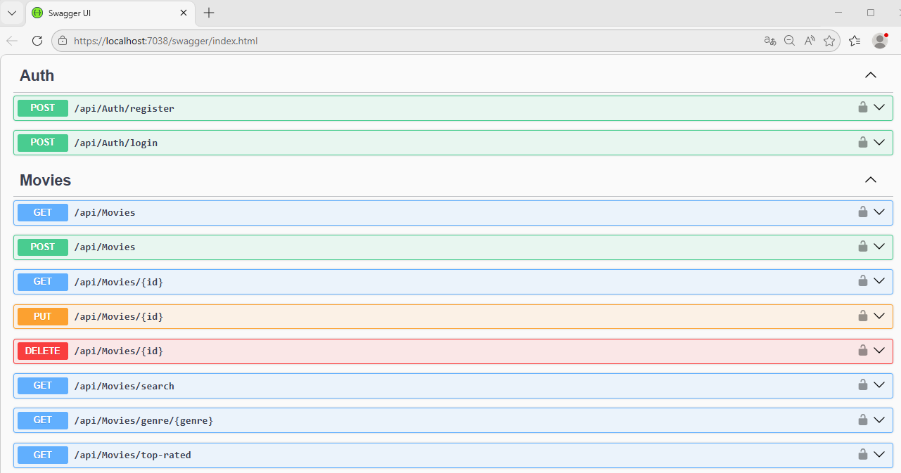
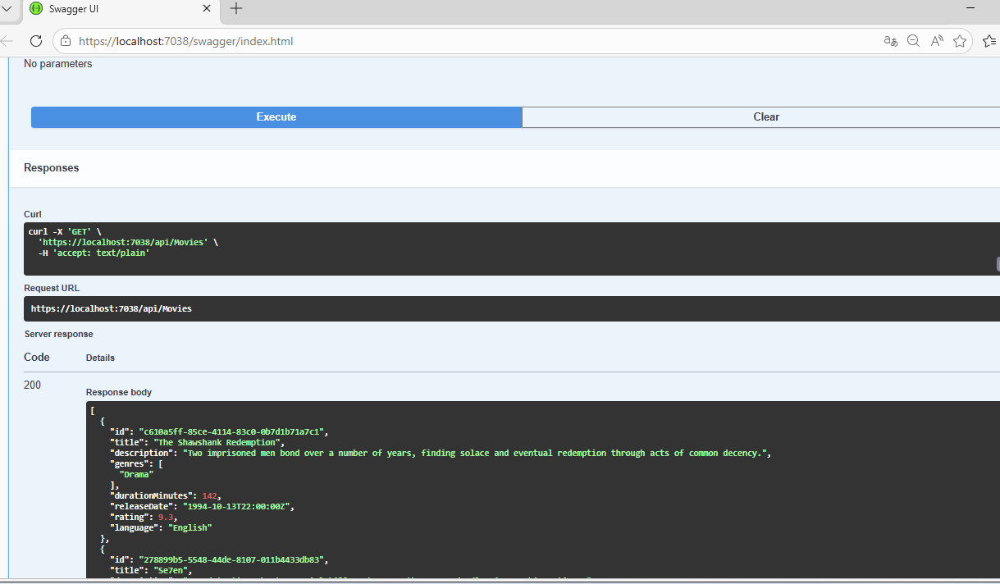
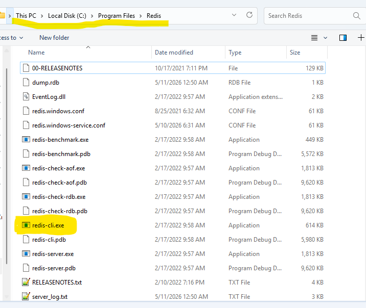
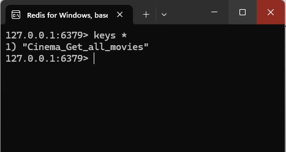

# 🎬 Cinema Management API

A modern, secure RESTful API with Clean Architecture for managing cinema operations, built with ASP.NET Core 9, MongoDB, Redis Cache, JWT authentication, and **CQRS pattern**.

## 🏗️ Clean Architecture

This project follows **Clean Architecture** (also known as Onion Architecture) to ensure separation of concerns, maintainability, and testability.

### Key Features of This Architecture

✅ **Separation of Concerns** - Each layer has a specific responsibility  
✅ **Testability** - Layers can be tested independently  
✅ **Maintainability** - Changes in one layer don't affect others  
✅ **Framework Independence** - Core logic doesn't depend on external frameworks  
✅ **Database Independence** - Easy to switch between databases  

### Project Details

#### 🎯 Cinema.Core (Domain Layer)
- Entities (Movie, User, etc.)
- Business rules and validations
- Repository interfaces
- No external dependencies

#### 🎯 Cinema.Application (Application Layer)
- Service implementations
- DTOs (Data Transfer Objects)
- AutoMapper profiles
- Business use cases
- CQRS Commands & Queries**
- MediatR Pipeline Behaviors**
- Depends only on Cinema.Core

#### 🎯 Cinema.Infrastructure (Infrastructure Layer)
- MongoDB data context
- Repository implementations
- Redis cache service (`RedisCacheService.cs`)
- Data access logic
- Implements interfaces from Cinema.Core

#### 🎯 Cinema.Api (Presentation Layer)
- REST API controllers
- JWT authentication middleware
- Program.cs configuration
- appsettings.json
- Depends on Application and Infrastructure

*Swagger UI showing Cinema API endpoints & Redis Cli*
<div align="left">
  
 
  <br>
  <em>Figure 1: Swagger API Documentation</em>
  <br>
  </div>
  <div align="left">
  
     <br>
  <em>Figure 1: Swagger API Documentation</em>
  <br>
  </div>
  <div align="left">
  
     <br>
  <em>Figure 3: How to run Redis Cli</em>
   <br>
   </div>
   <div align="left">
   
      <br>
    <em>Figure 4: Redis Cli Results</em>
  <br>
</div>

## ✨ Features

- 🔐 **JWT Authentication** - Secure token-based authentication
- 👥 **Identity Management** - User registration, login, and role-based access (Admin/User)
- 🎥 **Movie Management** - Complete CRUD operations for movies
- 🔍 **Advanced Search** - Search movies by title, genre, and ratings
- 📊 **Top Rated Movies** - Get top-rated movies with custom count
- 🎨 **Swagger Documentation** - Interactive API documentation
- 🗄️ **MongoDB Integration** - NoSQL database for high performance
- ⚡ **Redis Caching** - High-performance distributed caching for improved response times
- 🛡️ **Role-Based Authorization** - Admin-only endpoints for sensitive operations
- 📦 **CQRS Pattern** - Separation of Command and Query responsibilities
- 🔄 **MediatR** - In-process messaging for handling requests
  
## 🚀 Technology Stack

- **.NET 9** - Latest LTS version
- **ASP.NET Core Web API** - RESTful API framework
- **MongoDB** - NoSQL database
- **Redis** - In-memory distributed cache
- **JWT Bearer Authentication** - Token-based security
- **ASP.NET Core Identity** - User management with MongoDB store
- **AutoMapper** - Object-object mapping
- **Swagger/OpenAPI** - API documentation
- **Repository Pattern** - Clean architecture
- **Unit of Work Pattern** - Transaction management
- **CQRS (Command Query Responsibility Segregation)** - Separation of read/write operations
- **MediatR** - Message bus implementation
  
## 📋 Prerequisites

- [.NET 9 SDK](https://dotnet.microsoft.com/download/dotnet/9.0)
- [MongoDB](https://www.mongodb.com/try/download/community) (local or Atlas)
- [Redis](https://redis.io/download) (local or cloud like Redis Labs/Azure Cache)
- [Visual Studio 2022](https://visualstudio.microsoft.com/) or [VS Code](https://code.visualstudio.com/)
- [Git](https://git-scm.com/)
- 
## 📥 Redis for Windows (Development)

### Option A: Memurai (Recommended for Windows - No WSL needed)

[Download Memurai for Windows](https://www.memurai.com/)


### Option B: Docker (Alternative for any OS)

```bash
docker run -d -p 6379:6379 --name redis redis:alpine
```

 ## 📦 NuGet Packages Installation

Install these packages using Package Manager Console:

```powershell
Install-Package AspNetCore.Identity.MongoDbCore -Version 7.0.0
Install-Package Microsoft.Extensions.Caching.StackExchangeRedis -Version 10.0.7
Install-Package Microsoft.Extensions.Configuration.Abstractions -Version 10.0.7
Install-Package MongoDB.Bson -Version 3.8.0
Install-Package MongoDB.Driver -Version 3.8.0
Install-Package Newtonsoft.Json -Version 13.0.4
Install-Package MediatR -Version 11.1.0
Install-Package MediatR.Extensions.Microsoft.DependencyInjection -Version 11.1.0
```

🚀 Redis Caching Implementation
Caching Strategy
Get All Movies - Cached for 10 minutes by default
 
#Benefits Implemented
⚡ Reduced Database Load - Up to 80% reduction in MongoDB queries

🚀 Improved Response Times - 5-10x faster responses for cached endpoints

📈 Better Scalability - Handles more concurrent users with less resources

🔄 Distributed Cache - Works across multiple server instances

## 🗄️ MongoDB Configuration & JWT

## Add to `appsettings.json`

```json
  "ConnectionStrings": {
    "MongoDBConnection": "mongodb://localhost:27017",
    "Redis": "localhost:6379"
  },
  "MongoDB": {
    "DatabaseName": "CinemaDB"
  },
  "Jwt": {
    "Key": "your-super-secret-key-with-at-least-32-characters-long-for-jwt-security",
    "Issuer": "CinemaAPI",
    "Audience": "CinemaClient"
  },
  "AllowedHosts": "*"

```
## 🛠️ Installation

### 1. Clone the repository
```bash
git clone https://github.com/farissyria/Movie_app.git
cd Movie_app
```

